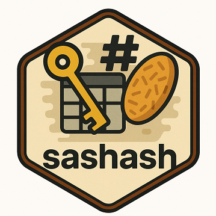

# sashash
The sashash package provides powerful and efficient hash-based lookup and validation tools specifically designed for SAS programming. Leveraging the robust capabilities of SAS hash objects, this package enables rapid and dynamic key-based data retrieval and existence checking directly within a single data step. This significantly reduces the need for separate sort and merge steps, streamlining workflows and enhancing performance.

  

# %kvlookup()
Enables efficient and dynamic retrieval of variables from a specified master dataset based on provided keys, directly within a single data step without separate sorting or merging. 
Usage Example: 

~~~sas  
%kvlookup(master=sashelp.class,
          key=Name,         
          var=Age Sex, 
          wh=　%nrbquote(Age > 12),
          warn=Y,
          dropviewflg=Y);
~~~

# %keycheck()
Dynamically validates the existence of keys within a master dataset directly within a single data step. Ideal for rapid data integrity checks and immediate flagging of key existence or non-existence. 
Usage Example: 

%keycheck(master=sashelp.class, 
          key=Name, 
          wh= %nrbquote(Age >= 15), 
          fl=exist_flag, 
          cat=YN, 
          dropviewflg=Y); 

# version history
0.0.1(22April2025): Initial version

# What is SAS Packages?
sashash is built on top of **SAS Packages framework(SPF)** created by Bartosz Jablonski. 
For more on SAS Packages framework, see [SASPAC](https://github.com/yabwon/SAS_PACKAGES). 
You can also find more SAS Packages(SASPAC) in [GitHub](https://github.com/SASPAC) 
